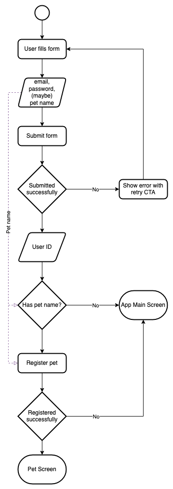
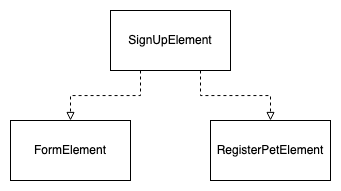

# Kelm Android Sample

## Sign Up Sample (Advanced)

This sample showcases a real world sign up flow with multiple screens.

### Child elements

Adding the entire **update** logic into a single function would be
unwise in this case because of its complexity. We could break the
**update** into smaller functions. Or, we could create child elements.

Child elements are easier to maintain when they have their own commands and
subscriptions.
In this sample, the main **SignUpElement** is split into smaller elements:

The arrows above represent dependencies.
`SignUpElement` is the parent element and will manage the child elements.

`FormElement` knows everything related to the `FormScreen`, including validation,
form submission and UI control. `FormElement` doesn't know anything about the other
elements, therefore simplifying its complexity.

All messages and commands from all elements pass through
`SignUpElement`. In the end, the `SignUpElement` has the model of the entire
flow, but, can delegate to child elements to update its sub-models.

Check the full implementation [here](src/main/java/kelm/sample/advancedSample).