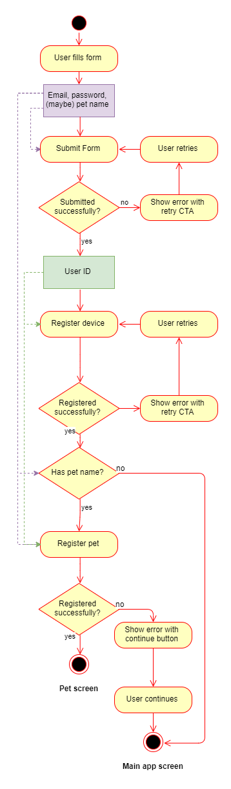
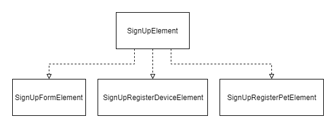

# Kelm Android Sample

## Sign Up Sample (Advanced)

This sample showcases a real world sign up flow with multiple screens.

### Switch context

Adding the entire **update** logic into a single function would be
unwise in this case because of its complexity. Instead, we break the
main **Element** into smaller elements:

The arrow direction of the above diagram represents the dependency.
`SignUpFormElement` doesn't know anything about the others elements,
therefore limiting its complexity. `SignUpElement` knows how to coordinate
all the elements of the flow.

All **Messages** and **Commands** from all **Elements** pass through
`SignUpElement`. Kelm provides a `UpdateContext::switchContext` function
that can help with delegating events to sub-Components.

Check the full implementation [here](src/main/java/kelm/sample/signUp).